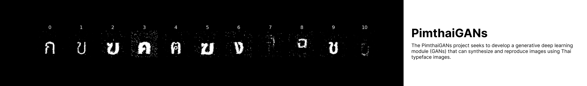

# pimthaigans

pimthaigans project is part of Ai builder
The project's goal is to employ generative AI to produce Thai character fonts based on Thai font data.

This githubs is for tools to gen model and whole notebooks that used

## Links to sub-github

- Dataset module
  - [github](https://github.com/Bermlnwza/PimthaiGANS-Dataset)
  - [Kaggle](https://www.kaggle.com/datasets/supawitmarayat/pimthaigans-dataset)
  - [Huggingface](https://huggingface.co/datasets/SupawitMarayat/PimthaiGANS-Dataset)
- Deploy module
  - [Website](https://github.com/Beamlnwza/pimthaigans-website)
  - [REST-Api](https://github.com/Beamlnwza/pimthaigans-api)
